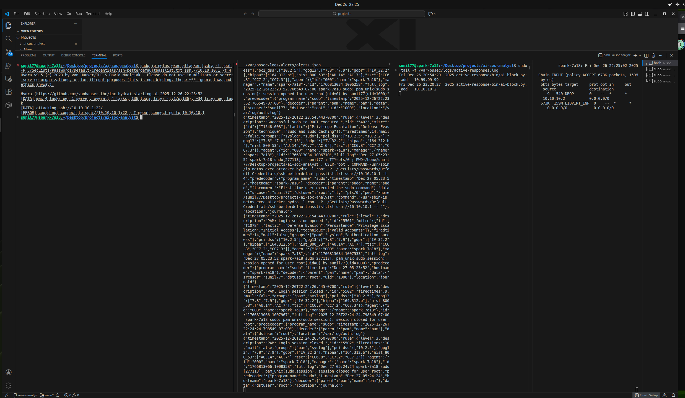

## **Project Overview**
This project demonstrates the transition from passive security monitoring to **autonomous remediation**. Using an NVIDIA DGX Spark (ARM64) as the host, I implemented a fully automated detection-to-remediation loop. The system identifies SSH brute-force attacks in real-time and dynamically updates the host’s kernel firewall (`iptables`) to isolate the threat.

## **1. The Professional Lab Environment**
To bypass standard localhost whitelisting and simulate a real-world external adversary, I utilized **Network Namespaces** and **Virtual Ethernet (Veth)** pairs. This architecture ensures that the "Attacker" is viewed as a separate entity from the "Victim" host.

*Figure 1: Networked simulation architecture showing the isolated 'attacker' namespace connected via a virtual bridge.*

## **2. Technical Workflow & Evidence**
The "Clean Result" was verified through four synchronized terminal outputs documenting the complete attack lifecycle.

### **A. Detection: The SOC "Brain"**
The Wazuh Manager monitors SSH logs and triggers a high-severity alert when brute-force thresholds are met.
* **Rule Triggered:** Rule ID 5758 ("Maximum authentication attempts exceeded").

### **B. Action: Custom AI Remediation**
The Wazuh `execd` daemon invokes a custom Python script (`ai-block.py`) that parses the JSON alert data and executes the block.
* **Log Entry:** `Fri Dec 26 22:20:27 2025 active-response/bin/ai-block.py: add - 10.10.10.2`.

### **C. Defense: The System Shield**
The Linux Kernel `iptables` is updated automatically without manual intervention.
* **Firewall Rule:** `-A INPUT -s 10.10.10.2/32 -j DROP`.

*Figure 2: Proof of Completion. Concludes the project on “Active Response” as I was able to demonstrate a fully automated detection-to-remediation loop where the host now defends itself against brute-force attacks in real-time.*

## **3. Simulation Results**
Once the autonomous block was applied, the attacker (Hydra) reported a **"Timeout"** error. This proves the system successfully "silenced" the threat mid-attack, protecting the host's integrity.

## **Key Skills Demonstrated**
* **Security Automation:** Developing Active Response scripts for ARM64 Linux environments.
* **Networking:** Implementing Virtual Ethernet and Network Namespaces for secure lab simulations.
* **SIEM Management:** Customizing Wazuh rule triggers and global configurations (`ossec.conf`).
* **System Defense:** Hardening host perimeters using kernel-level `iptables`.

---

## **For step-by-step proof of completion and guidance, please refer to the completion report below.**
%20on%20your%20NVIDIA%20DGX%20(ARM64).pdf)