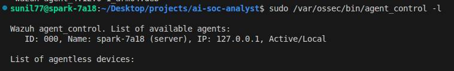
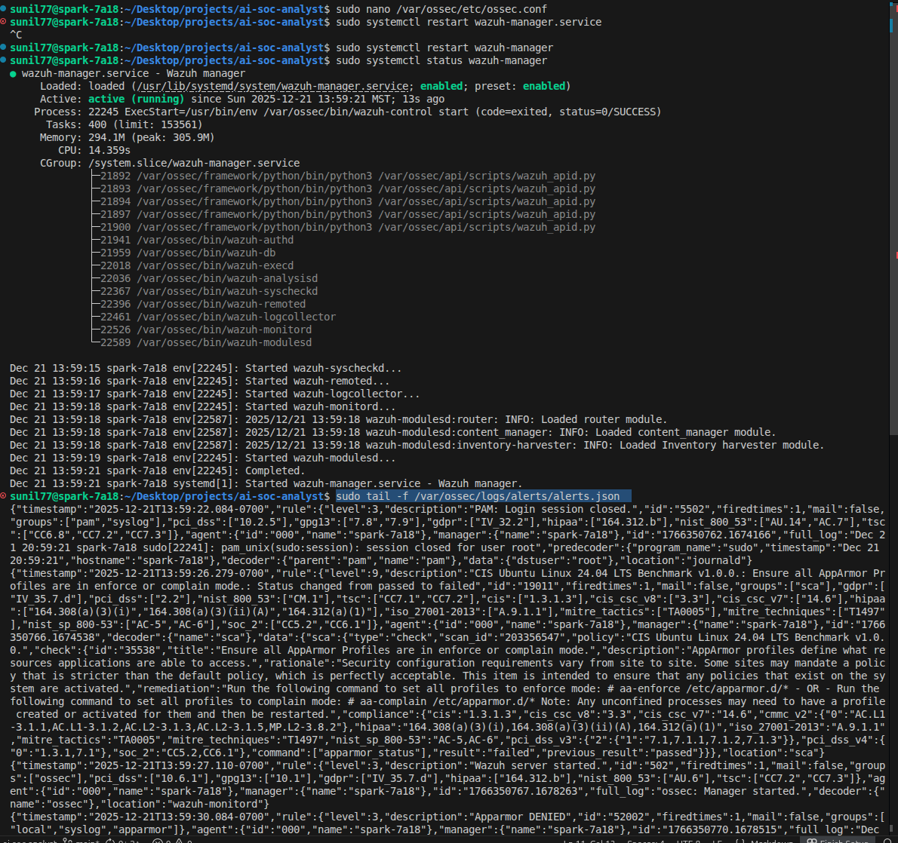

# Agent Enrollment

## Objective 
The goal was to verify the DGX Spark using Wazuh's built-in agent (ID 000) for self-monitoring. A package conflict between wazuh-agent and wazuh-manager was resolved by utilizing the native agent, optimizing resource usage on the ARM64 platform by reducing redundant processes.

### 1. Verification: The Built-in Agent  
Since I’m using the **DGX Spark** as both the Manager and the first monitored endpoint, Wazuh automatically assigns the Manager’s internal agent ID as **000** during self-monitoring configuration. The screenshot below shows the command and result proving this.

**Deployment Pivot**: During installation, a package conflict was identified between **wazuh-agent** and **wazuh-manager**. To resolve this, host monitoring was implemented using the native Agent 000 built into the Manager, optimizing resource usage on the ARM64 platform by eliminating redundant background processes.



---

### 2. Self-Monitoring Hardening  
As the Manager holds critical security data, I configured the built-in agent to monitor the **NVIDIA DGX’s critical system files**.  

#### Configuration  
Command:  
```bash
sudo nano /var/ossec/etc/ossec.conf
```
The <syscheck> section controls File Integrity Monitoring (FIM). The screenshot below confirms it’s monitoring my home project directory.



---

