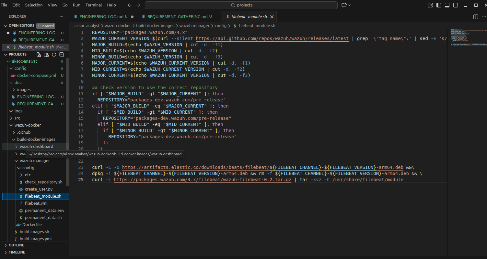
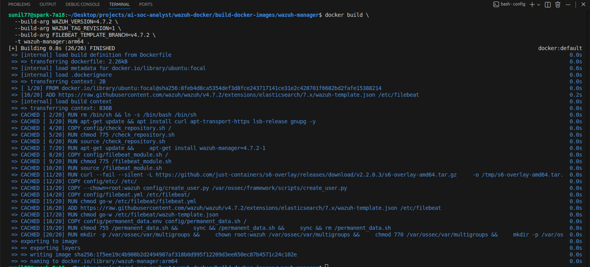

# Engineering Log: Infrastructure Build (Wazuh on ARM64)

**Date:** 12-18-2025
**Device:** NVIDIA DGX Spark (aarch64)
**Component:** Wazuh Manager Container
**Git Repository:** `https://github.com/wazuh/wazuh-docker.git` (Branch: `v4.7.2`)

---

## 1. The Challenge (Situation)
The project requires running the Wazuh SIEM Manager on NVIDIA ARM64 hardware to support local Agentic AI integration.

* **Blocker:** The official Docker image defined in `docker-compose.yml` (`wazuh/wazuh-manager:4.7.2`) is built exclusively for x86_64 (Intel/AMD).
* **Failure Mode:** Pulling the standard image resulted in an `exec format error` and a crash-loop due to instruction set incompatibility with the DGX CPU.

---

## 2. The Solution (Action)
I initiated a custom build pipeline to compile the Wazuh Manager locally for `aarch64`.

### Step 1: Custom Docker Build
Cloned the official repo into `~/projects/ai-soc-analyst/wazuh-docker` and checked out tag `v4.7.2` to ensure a stable baseline.

### Step 2: Script Patching
I had to patch `build-docker-images/wazuh-manager/config/filebeat_module.sh` because the upstream scripts contained two critical bugs preventing ARM64 compilation:

* **2.1. Architecture Hardcoding:** The script explicitly requested `amd64.deb` packages. I used `sed`/manual editing to replace all instances with `arm64.deb`.
* **2.2. Broken Variable Logic:** The build failed at the `curl` step with `gzip: stdin: not in gzip format`.
    * **Root Cause:** The variable `${WAZUH_FILEBEAT_MODULE}` was resolving to empty during the build, causing `curl` to fetch a 404 page instead of the `.tar.gz` artifact.
    * **Fix:** I bypassed the variable logic and hardcoded the stable 4.x URL directly into `filebeat_module.sh`:

**Old Code:**
```bash
curl -s https://${REPOSITORY}/filebeat/${WAZUH_FILEBEAT_MODULE} | tar -xvz ...
curl -L [https://packages.wazuh.com/4.x/filebeat/wazuh-filebeat-0.2.tar.gz](https://packages.wazuh.com/4.x/filebeat/wazuh-filebeat-0.2.tar.gz) | tar -xvz ...
```

### Evidence
**Figure 1: Patching the Build Script**


### Step 3: Build Arguments
Executed the build from `build-docker-images/wazuh-manager/` using specific build args to force the versioning:

```bash
docker build \
  --build-arg WAZUH_VERSION=4.7.2 \
  --build-arg WAZUH_TAG_REVISION=1 \
  --build-arg FILEBEAT_TEMPLATE_BRANCH=v4.7.2 \
  -t wazuh-manager:arm64 .

```

### Evidence
**Figure 2: Successful ARM64 Compilation**


## 3. Conclusion (Result)
* Successfully compiled a custom `wazuh-manager:arm64` image.
* Verified compatibility with the NVIDIA DGX kernel.
* Decoupled the project from upstream x86 dependencies, ensuring long-term stability on Edge hardware.