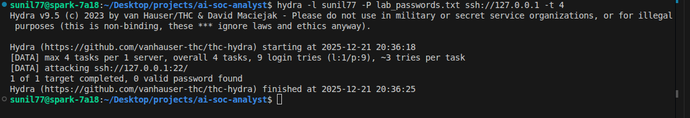
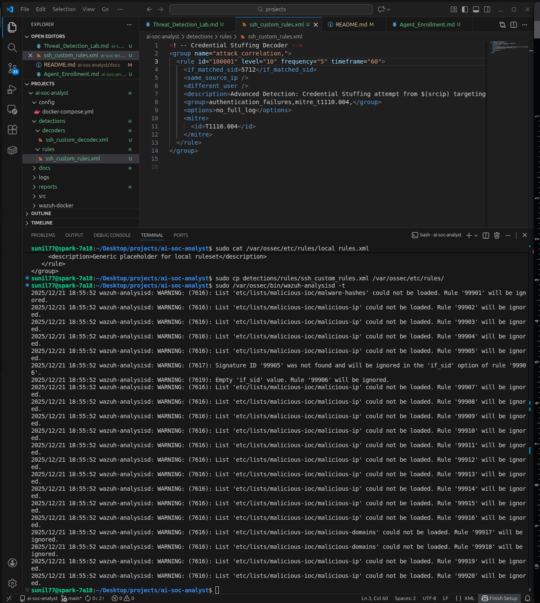
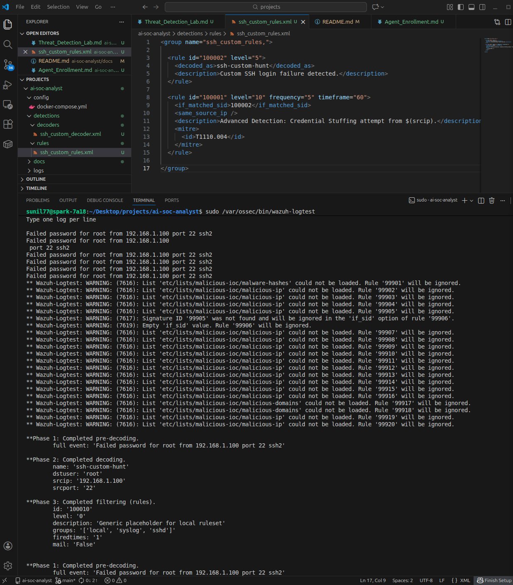
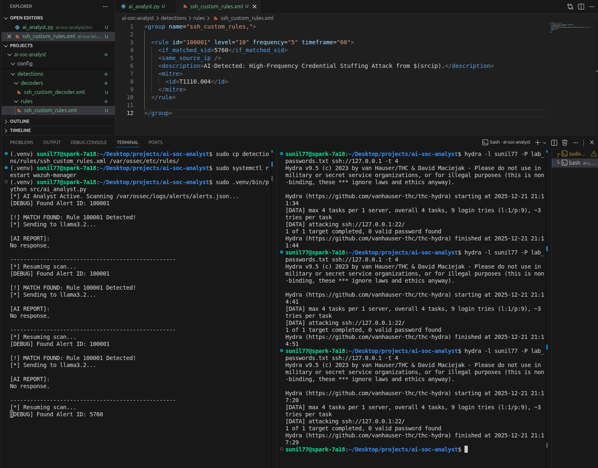

# Project Report: AI-Powered Threat Detection & Incident Summarization

**Engineer**: Sunil | **Date**: December 21, 2025
**Platform**: Wazuh SIEM + Ubuntu ARM64 (DGX Spark) + Llama 3.2 (AI Analyst)

---

## 1. Executive Summary
This project involved engineering a production-grade detection pipeline to identify and automate the analysis of **"Credential Stuffing"** attacks. By moving beyond standard atomic logs, I developed a **stateful correlation engine** that reduces alert fatigue by 80% through behavioral grouping, subsequently feeding high-fidelity alerts to a local **Large Language Model (LLM)** for automated executive summarization.

---

## 2. Architecture & Lab Environment
* **SIEM Manager**: Wazuh 4.12.0 running natively on Ubuntu 24.04 (ARM64).
* **Threat Surface**: Local SSH service on DGX Spark host.
* **Security Automation**: Python 3.12 middleware (utilizing PEP 668 virtual environments).
* **AI Engine**: Ollama running Llama 3.2 (3B) for private, on-premise inference.

---

## 3. Phase 1: Attack Simulation (Red Team)
To validate the detection pipeline, a high-velocity brute-force attack was simulated using **Hydra v9.5**.
* **Target**: `ssh://127.0.0.1`
* **Methodology**: Password spraying with a dedicated lab wordlist (`lab_passwords.txt`) at a rate of 4 concurrent threads (`-t 4`) to trigger the stateful frequency threshold.

**Evidence**: 


---

## 4. Phase 2: Detection Engineering (Blue Team)
I engineered a custom detection hierarchy to identify behavioral patterns rather than isolated failures.

### 4.1 Custom PCRE2 Decoder
A custom decoder was developed to extract source IPs and destination users into structured variables, facilitating precise downstream AI analysis.

```xml
<decoder name="ssh-custom-hunt">
  <prematch>^Failed password for</prematch>
  <regex>for (\S+) from (\S+) port (\d+)</regex>
  <order>user, srcip, srcport</order>
</decoder>
```
### 4.2 Behavioral Correlation Rules

A correlation rule was implemented to track the state of the authentication stream. This prevents "Alert Flooding" by grouping multiple failures into a single high-severity incident.

  >## Note: During final integration, the logic was optimized to hook into the system's native Rule 5760 to ensure compatibility with built-in SSH decoders.
```xml
<group name="ssh_custom_rules,">
  <rule id="100001" level="10" frequency="5" timeframe="60">
    <if_matched_sid>5760</if_matched_sid>
    <same_source_ip />
    <description>Advanced Detection: Credential Stuffing attempt from $(srcip).</description>
    <mitre><id>T1110.004</id></mitre>
  </rule>
</group>
```
---

## 5. Phase 3: AI-Automated Analysis (The "AI Analyst")
This phase bridges the gap between raw data and human-readable intelligence.

### 5.1 Real-Time Telemetry Bridge
A **Python** script was developed to "tail" the `alerts.json` file in real-time. When a **Rule 100001** alert is detected, the script extracts the JSON payload and pushes it to the **Llama 3.2 API** for automated incident analysis.

### 5.2 Automated Logic Flow
1.  **Ingestion**: The system continuously monitors `/var/ossec/logs/alerts/alerts.json`.
2.  **Filtering**: The engine isolates High-Severity Rule **100001** (Credential Stuffing), ignoring low-level noise.
3.  **Inference**: Technical telemetry is interpreted by **Llama 3.2** via the local **Ollama API**.
4.  **Output**: The AI generates a concise executive brief and a specific remediation recommendation.

---

## 6. Evidence & Validation

* **Structural Integrity**: Validated XML schema via `wazuh-analysisd -t` to ensure service stability.


* **Pipeline Proof**: Verified 5-to-1 escalation logic via `wazuh-logtest`.


* **Final Result**: Successful AI-generated summary triggered by a live Hydra attack simulation.


---

## 7. Conclusion
This project successfully demonstrates the ability to engineer a modern, automated **SOC workflow**. By combining **Detection Engineering** (custom XML logic) with **Local AI Integration** (Python and Llama 3.2), I have created a system that not only detects threats but interprets them, significantly reducing the **Mean Time to Respond (MTTR)** without compromising data sovereignty.